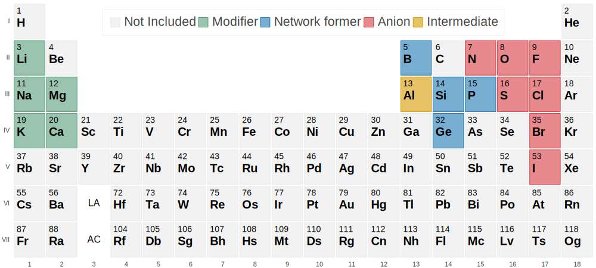

# Accelerating the Discovery of High-Conductivity Glass Electrolytes via Machine Learning

**Rasmus Christensen <sup>1*</sup>, Morten M. Smedskjaer<sup>1</sup>**

<sup>1</sup> Department of Chemistry and Bioscience, Aalborg University, Aalborg, Denmark  


**\*** E-mail: [rasmusc@bio.aau.dk](mailto:rasmusc@bio.aau.dk)




## Supplementary Data
This repository includes the data and analysis code used in the paper listed above. 

### Folders:

#### `validation_structures`
Folders containing the validation glass structures from the Grace/FS interatomic potentials, in the LAMMPS data format:
- `in.quench` is the input file for the LAMMPS simulations.
- `300K_.dat` is the glass structure at 300K in the LAMMPS data format.
- `md_stats.lammpstrj` is the final trajectory file at 300K from after quenching and relaxation.

#### `potential`
Potential files for the Grace/FS potential and training data and input files

- `FS_model_i3.yaml` and `saved_model` contain the parameters for the ACE potential, formated for the use with MPI on CPUs and Tensorflow on GPUs, respectively in `LAMMPS` and `ASE` . See `Notes on Grace/FS potential` for more information. 
- `input.yaml` is the input yaml file used for the GRACEMAKER framework for potential optimization.
##### `active_learning`
 - `balace.yaml` input file for running active learning workflow from the [vitrum package](https://vitrum.readthedocs.io/en/latest/). The active learning workflow employed here was run using this [Github commit](https://github.com/R-Chr/vitrum/commit/393454f573d4bae5f57cd9e23e926085838cccb0), and is not guaranteed to work with the newest vitrum version without changes to the input file.
 - `run.py` script for executing workflow

#### `model_example`
- `predictive_model.ipynb` Notebook containing the code used to train and test the predictive model used in the paper. Requires downloading the data from [figshare](https://doi.org/10.6084/m9.figshare.29533097.v2).

### Data available from figshare
Additional data used in the paper, including the diffusion dataset and the Glass25 training dataset is available from [figshare](https://doi.org/10.6084/m9.figshare.29533097.v2). (https://doi.org/10.6084/m9.figshare.29533097.v2)

- `Diffusion_dataset`
  - `diffusion.pckl.gzip` is the diffusion dataset generated of all generated glasses.
    - Contains atomic structures as `ase.Atoms` objects with corresponding diffusion properties, and calculated features for diffusion prediction.
    - Load using: `df = pandas.read_pickle('diffusion.pckl.gzip', compression='gzip')`
- `Glass25`
  - `train.pckl.gzip` and `test.pckl.gzip` is the Glass25 training dataset generated after all iterations of active learning. 
    - Contains atomic structures as `ase.Atoms` objects with corresponding energies  forces, and stresses.
    - Load using: `df = pandas.read_pickle('train.pckl.gzip', compression='gzip')`


## Notes on Grace/FS potential
Information about the Grace/FS potential can be found in its [documentation](https://gracemaker.readthedocs.io/en/latest/).

### INSTALL
To install the new version of LAMMPS, follow the instructions in the gracemaker [documentation](https://gracemaker.readthedocs.io/en/latest/gracemaker/install/#lammps-with-grace).

For CPUs, the following commands should be used:
```
cd lammps
mkdir build
cd build 
cmake -DCMAKE_BUILD_TYPE=Release -D BUILD_MPI=ON -DPKG_ML-PACE=ON -DNO_GRACE_TF=ON -DPKG_EXTRA-PAIR=ON ../cmake
cmake --build .
```

For GPUs, the following commands should be used:
```
# Needs tensorflow installed
pip3 install --upgrade pip
pip3 install tensorflow[and-cuda]==2.15.1
pip3 install tf-keras==2.15.1
pip3 install keras==2.15.0

cd lammps
mkdir build
cd build
cmake -DCMAKE_BUILD_TYPE=Release -D BUILD_MPI=ON -DPKG_ML-PACE=ON -DPKG_MC=ON -DPKG_EXTRA-PAIR=ON -DTF_PATH=/<path_to_tensorflow> ../cmake
cmake --build . -- -j 8
```

### USE POTENTIAL
To use the potential in LAMMPS use the following commands:

For CPUs, the following commands should be used:
```
# Only Grace/fs potential
pair_style grace/fs 
pair_coeff * * ../FS_model_i3.yaml Li B N O F Na Mg Al Si P S Cl K Ca Ge Br I

# With Grimme d3 dispersion correction (helps with better density agreement)
pair_style hybrid/overlay grace/fs dispersion/d3 bj pbe 12 12
pair_coeff * * grace/fs ../FS_model_i3.yaml Li B N O F Na Mg Al Si P S Cl K Ca Ge Br I
pair_coeff * * dispersion/d3 Li B N O F Na Mg Al Si P S Cl K Ca Ge Br I
```

For GPUs, the following commands should be used: **(Note: d3 dispersion is currently not GPU accelerated, it will be slow on GPUs)**
```
# Just grace/fs potential
pair_style grace
pair_coeff * * ../saved_model Li B N O F Na Mg Al Si P S Cl K Ca Ge Br I

# With Grimme d3 dispersion correction 
pair_style hybrid/overlay grace dispersion/d3 bj pbe 12 12
pair_coeff * * grace ../saved_model Li B N O F Na Mg Al Si P S Cl K Ca Ge Br I
pair_coeff * * dispersion/d3 Li B N O F Na Mg Al Si P S Cl K Ca Ge Br I
```

## Citation
If you use this data or code in your research, please cite our paper:
- Christensen R., Smedskjær MM. Accelerating the Discovery of High-Conductivity Glass Electrolytes via Machine Learning. ChemRxiv. 2025; [DOI:10.26434/chemrxiv-2025-7csf2](https://doi.org/10.26434/chemrxiv-2025-7csf2)

## Funding
This work was supported by the Danish Data Science Academy, which in turn is funded by the Novo Nordisk Foundation (NNF21SA0069429) and VILLUM FONDEN (40516).
